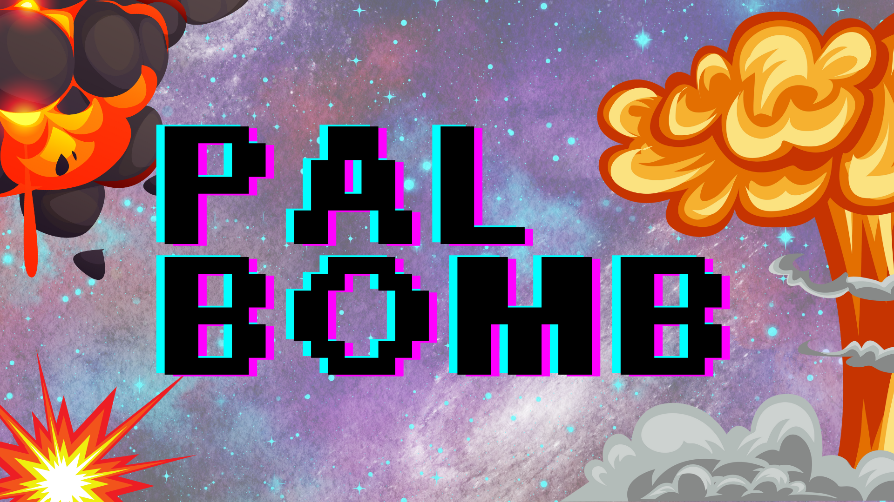
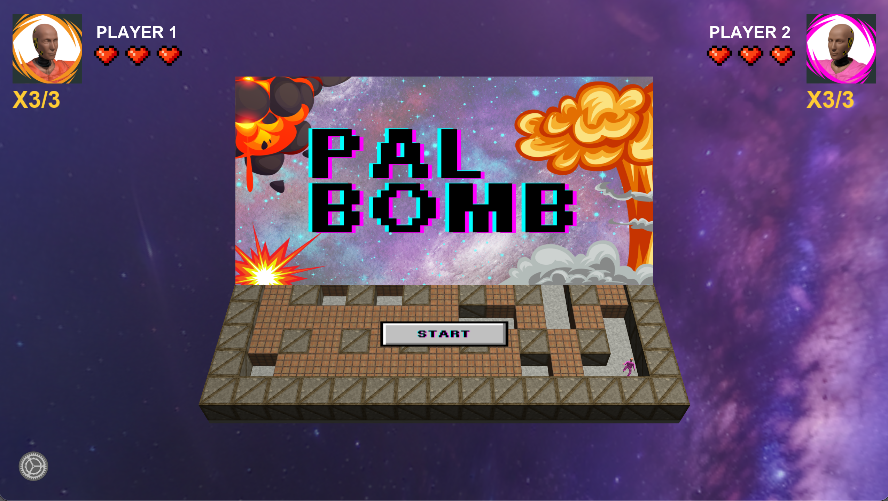
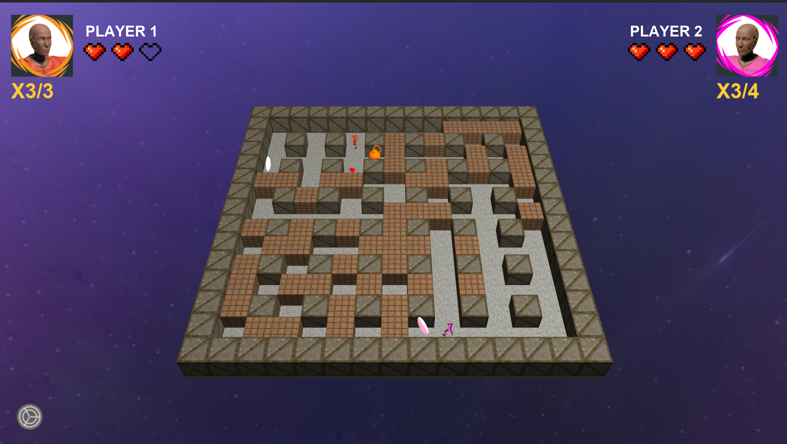

# 💣 PalBomb - Bomber Game

เกม Bomber สไตล์ Top-Down แบบ 2 ผู้เล่น พัฒนาด้วย OpenGL พร้อมกราฟิก 3D, ระบบแสง และเอฟเฟกต์สวยงาม

## 🎮 เกี่ยวกับเกม

**PalBomb** เป็นเกม Bomber แบบ multiplayer ที่ผู้เล่น 2 คนต่อสู้กันในสนามขนาด 15x15 ช่อง ด้วยการวางระเบิดทำลายบล็อก เก็บไอเทม และพยายามเอาชนะฝ่ายตรงข้าม

- 🎯 **เป้าหมาย**: ทำให้ Health ของฝ่ายตรงข้ามลดลงจนหมดเพื่อชนะเกม
- 👥 **ผู้เล่น**: รองรับ 2 ผู้เล่นบนคอมพิวเตอร์เครื่องเดียว
- 🗺️ **แผนที่**: สนามขนาด 15x15 ช่อง พร้อมบล็อกทำลายไม่ได้และบล็อกทำลายได้แบบสุ่ม
- 💖 **ระบบ Health**: ผู้เล่นมี Health 3 จุด พร้อมระบบ Invulnerability Frames

## 📸 Preview







## ⭐ Feature หลัก

### 💥 ระบบระเบิด (Bomb System)
- **วางระเบิด**: ผู้เล่นสามารถวางระเบิดได้ (จำกัดจำนวนตามไอเทม)
- **ระเบิดแบบกากบาท**: ระเบิดจะทำลายบล็อกในรูปแบบกากบาท (4 ทิศทาง)
- **Explosion Preview**: แสดงพื้นที่ที่จะถูกระเบิดล่วงหน้า ด้วยเอฟเฟกต์ pulsing
- **Bomb Timer**: ระเบิดจะทำงานหลังจาก 3 วินาที
- **ระยะระเบิด**: ระเบิดได้ 2 ช่องในแต่ละทิศทาง (ปรับได้ด้วยไอเทม)

### 🎁 ระบบ Power-Up (5 ประเภท)
Power-Up จะดรอปแบบสุ่มเมื่อทำลายบล็อก ผู้เล่นเก็บได้โดยเดินเข้าไป

1. **💣 Bomb Capacity**: เพิ่มจำนวนระเบิดที่วางได้พร้อมกัน
2. **💥 Range Boost**: เพิ่มระยะการระเบิด
3. **🛡️ Shield**: ป้องกันการโดนระเบิด 1 ครั้ง
4. **⚡ Speed Boost**: เพิ่มความเร็วในการเคลื่อนที่
5. **💖 Heart**: ฟื้น Health 1 จุด (สูงสุด 4 จุด)

### 🏃 ระบบการเคลื่อนที่
- **Grid-Based Movement**: เคลื่อนที่แบบทีละช่อง พร้อม smooth animation
- **Collision Detection**: ไม่สามารถเดินผ่านบล็อก, ขอบแผนที่, ผู้เล่นอื่น หรือระเบิดได้
- **แอนิเมชันตัวละคร**: 
  - Idle Animation เมื่ออยู่นิ่ง
  - Walk Animation เมื่อเคลื่อนที่
- **สามารถควบคุมได้ระหว่างเคลื่อนที่**: ผู้เล่นสามารถเปลี่ยนทิศทางหรือวางระเบิดระหว่างเคลื่อนที่

### 💖 ระบบ Health
- **Health เริ่มต้น**: ผู้เล่นมี 3 จุด (แสดงเป็นหัวใจ)
- **รับดาเมจ**: ลด Health เมื่อโดนระเบิด
- **Invulnerability Frames**: ผู้เล่นจะปลอดภัย 1 วินาทีหลังโดนระเบิด (ป้องกันการโดนซ้ำ)
- **Shield**: ไอเทม Shield จะป้องกันการโดนระเบิด 1 ครั้ง
- **ฟื้น Health**: เก็บไอเทม Heart เพื่อฟื้น Health (สูงสุด 4 จุด)

### 🎨 กราฟิกและเอฟเฟกต์
- **มุมมอง Top-Down 3D**: กล้องมองจากด้านบนด้วย perspective projection
- **ระบบแสง Phong Lighting**: แสงที่สมจริงด้วย Ambient + Diffuse + Specular
- **Skybox**: พื้นหลัง 3D รอบๆ แผนที่ พร้อมหมุนอัตโนมัติ
- **Texture Mapping**: พื้นผิวคอนกรีต, ไม้, และอิฐสำหรับบล็อกต่างๆ
- **4x MSAA Anti-Aliasing**: ภาพเรียบไม่หยัก
- **Explosion Preview**: เอฟเฟกต์ pulsing บนพื้นที่ที่จะถูกระเบิด

### 🔊 ระบบเสียง
- **เพลงพื้นหลัง**: เพลงบรรยากาศเล่นวนซ้ำตลอด (ปรับระดับเสียงได้)
- **เสียงเอฟเฟกต์**: 
  - เสียงวางระเบิด
  - เสียงระเบิด
  - เสียงเก็บ Power-Up
- **ระบบ Mute**: ปิด/เปิดเสียงได้ในเมนู Settings

### 🎯 UI และเมนู
- **หน้า Intro**: หน้าจอเริ่มต้นพร้อมปุ่ม Start และ Settings
- **แสดง Health**: หัวใจแสดงสถานะ Health ของผู้เล่นทั้ง 2 คน
- **แสดงโปรไฟล์**: รูปโปรไฟล์และชื่อผู้เล่นทั้ง 2 คน
- **Settings Menu**: ปรับระดับเสียง/Mute, ปิดเกม
- **Game Over Screen**: หน้าจอจบเกมพร้อมปุ่ม Restart และ Quit
- **ข้อมูลตัวละคร**: แสดงรูป, ชื่อ และ Health ของผู้เล่นแบบ Real-time

### 🗺️ ระบบแผนที่
- **ขนาด**: 15x15 ช่อง
- **บล็อกขอบ**: ขอบแผนที่ทำลายไม่ได้
- **บล็อกแพทเทิร์น**: บล็อกทำลายไม่ได้วางเป็นแพทเทิร์นกากบาท
- **บล็อกทำลายได้**: สร้างแบบสุ่ม 60% ของพื้นที่ว่าง
- **จุด Spawn**: ผู้เล่นเริ่มต้นที่มุมตรงข้ามกัน (ซ้ายบนและขวาล่าง)
- **Regenerate Block**: กด **R** เพื่อสร้างบล็อกทำลายได้ใหม่แบบสุ่ม

## 🎮 การควบคุม

### เมนูและระบบ
- **ESC**: ปิดเกม
- **R**: สร้างบล็อกทำลายได้ใหม่แบบสุ่ม (ระหว่างเล่นเกม)
- **Mouse Click**: คลิกปุ่มต่างๆ บน UI (Start, Settings, Restart, Quit)

### Player 1 (ซ้ายบน) 🔴
- **W** / **A** / **S** / **D**: เดินบน/ซ้าย/ล่าง/ขวา
- **Q**: วางระเบิด

### Player 2 (ขวาล่าง) 🔵
- **Arrow Keys (↑ ← ↓ →)**: เดินบน/ซ้าย/ล่าง/ขวา
- **M**: วางระเบิด

## 🛠️ เทคโนโลยีที่ใช้

- **OpenGL 3.3** - Graphics Rendering
- **GLFW** - Window และ Input Management
- **GLM** - Math Library (Vectors, Matrices)
- **Assimp** - 3D Model Loading และ Animation
- **STB Image** - Texture Loading
- **AVFoundation** (macOS) - Audio System
- **CMake** - Build System

## 📁 โครงสร้างโปรเจค

```
GameEngProject-Palbom/
├── assets/                   # ไฟล์ Resources
│   ├── Floor/               # Textures พื้น
│   ├── Unbreakable_Block/   # Textures บล็อกทำลายไม่ได้
│   ├── Breakable_Block/     # Textures บล็อกทำลายได้
│   ├── BombRange/           # Textures explosion preview
│   ├── Background/          # Skybox textures
│   ├── Character/           # โมเดลและ textures ตัวละคร
│   ├── item/                # โมเดลระเบิดและไอเทม
│   ├── UI/                  # รูปภาพ UI (ปุ่ม, หัวใจ, โปรไฟล์)
│   └── sound/               # ไฟล์เสียง
├── shaders/                 # Shader Programs
│   ├── tile.vs/fs           # Tile rendering
│   ├── skybox.vs/fs         # Skybox rendering
│   ├── anim_model.vs/fs     # Character animation
│   ├── bomb.vs/fs           # Bomb rendering
│   └── ui.vs/fs             # UI rendering
├── src/                     # Source Code
│   ├── main.cpp             # Game Loop หลัก
│   ├── audio_player.h/mm    # Audio System (macOS)
│   └── filesystem.h         # File path utilities
└── CMakeLists.txt           # Build Configuration
```

## 🚀 วิธีติดตั้งและรัน

### ความต้องการของระบบ
- CMake 3.16+
- C++17 Compiler
- OpenGL 3.3+

### Build และ Run

```bash
# Build
cmake -S . -B build
cmake --build build

# Run
cd build
./RunGame
```

### Windows
```bash
cmake -S . -B build
cmake --build build --config Release
cd build/Release
RunGame.exe
```

## 🎯 เกมเพลย์และกลยุทธ์

### เทคนิคการเล่น
- **วางระเบิดกั้นทาง**: ใช้ระเบิดปิดทางหนีของฝ่ายตรงข้าม
- **เก็บไอเทม Speed**: เพิ่มความเร็วเพื่อหลบระเบิดได้ง่ายขึ้น
- **เก็บ Shield ก่อน**: Shield ช่วยป้องกันการโดนระเบิดครั้งแรก
- **เพิ่ม Bomb Capacity**: วางระเบิดได้หลายลูกพร้อมกันเพื่อปิดล้อมฝ่ายตรงข้าม
- **เพิ่ม Range**: ระยะระเบิดไกลขึ้น ทำให้ยากต่อการหลบ

### การทำลายบล็อก
- บล็อกทำลายได้จะดรอป Power-Up แบบสุ่ม
- ทำลายบล็อกเพื่อเปิดพื้นที่และเพิ่มโอกาสได้ไอเทม

---

**สนุกกับการเล่น PalBomb!** 💣💥
